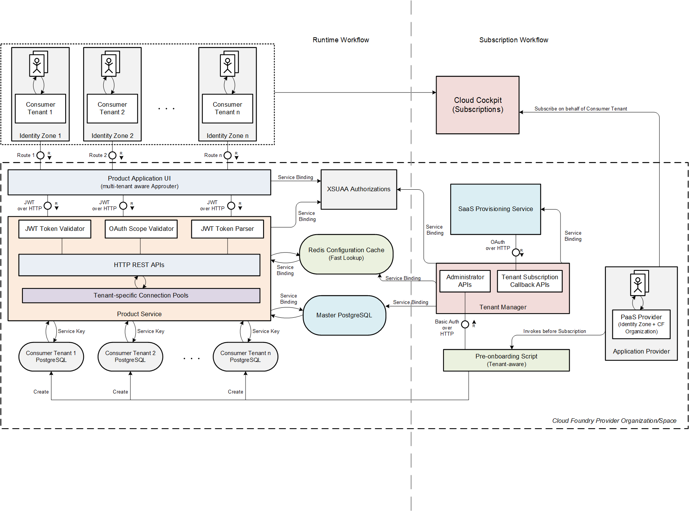

## Developing a Multi-tenant Business Application on SAP Cloud Platform in the Cloud Foundry Environment

This repository contains a sample reference application for developing and deploying a SaaS (software-as-a-service) multitenant business application on SAP Cloud Platform Cloud Foundry environment. Follow the instructions below to deploy the application on SAP Cloud Platform in a subaccount that is configured for the Cloud Foundry environment.
The sample application uses PostgreSQL and Redis as backing services. 

### Introduction to Multi-tenant Business Applications

As mentioned [here](https://blogs.sap.com/2018/09/26/multitenancy-architecture-on-sap-cloud-platform-cloud-foundry-environment/):

"_Multitenancy refers to a software architecture, in which tenants **share the same technical resources**, but keep the **data separated** and **identity and access management for each tenant isolated**_."

A multi-tenant business application provides a suite of functional services to a group of customers. The developer and deployer of the application service (e.g. a company with a Global Account on SAP Cloud Platform) is often referred to as the _provider_ while the customers of the service are referred to as _consumers_.

### Prerequisites

- You understand the concepts of multitenancy in the Cloud Foundry environment; see this [blog](https://blogs.sap.com/2018/09/17/developing-multitenant-applications-on-sap-cloud-platform-cloud-foundry-environment/).
- You understand the domain model (account structure) of SAP Cloud Platform; see this [blog](https://blogs.sap.com/2018/05/24/a-step-by-step-guide-to-the-unified-sap-cloud-platform-cockpit-experience/).
- You know how to work with the Cloud Foundry Command Line Interface (cf-cli).

#### Notes

We will use the Cloud Foundry CLI for deploying the applications onto the Cloud Foundry landscape. The process can be simplified further into a unified deployment experience using the concept of Multi-Target Archives (MTAs). This is left to the reader as an exercise in order to keep the concerns of deployment separate from the intention of developing a multi-tenant application.

### Component Architecture

The following diagram illustrates the high-level component architecture for this application:



#### Subscription Workflow

- Each _consumer tenant_ represents a Subaccount in the _application provider's_ SAP Cloud Platform Global Account. Each subaccount is expected to have its own security configurations and its own user-base (identity zone)
- SAP Cloud Platform provides the _SaaS provisioning service_ which can be used for automating the tenant subscription (aka _tenant onboarding_) workflows. 
- In this exercise, the mode of data isolation is to map a consumer subaccount to an isolated instance of _PostgreSQL_ running within the boundaries of the Cloud Foundry space of the application provider
- Since PostgreSQL instance provisioning is asynchronous and time-consuming in nature, the idea is to split the tenant onboarding workflow into a two-step process:
  - The repository provides an [interactive shell script](tenant-manager/admin/create_consumer.sh), which needs to be run by an application administrator of the Cloud Foundry space (typically with Space Developer access privileges assigned). The script is responsible for creating the PostgreSQL instance, creating a service key for the instance and calling an administration API secured via basic authentication credentials, which creates a mapping between the consumer subaccount and the corresponding PostgreSQL instance's credentials.
  - Once the shell script has been executed, the application provider's account administrator is expected to navigate to the consumer subaccount's _Subscriptions_ page in the _Cloud Cockpit_ and press on the _Subscribe_ button. This initiates the _SaaS provisioning_ workflow whereby the SaaS provisioning service invokes the tenant onboarding callback API. The callback API is expected to complete the onboarding workflow by performing [_database schema migration_](https://en.wikipedia.org/wiki/Schema_migration) for the consumer's PostgreSQL database, store the credentials for the subaccount into _Redis_ for fast dictionary-based lookup at runtime and return the consumer-specific URL for the application

#### Runtime Workflow

- To reiterate, each _consumer tenant_ represents a Subaccount in the _application provider's_ SAP Cloud Platform Global Account. Each subaccount is expected to have its own security configurations and its own user-base (identity zone)
- The _product application UI_ component is based on the multi-tenant aware _application router_ library. The approuter is responsible for participating in the OAuth _authorization code_ workflow for browser-based access (using the XS UAA), providing reverse proxying capabilities to backend destinations over secure HTTP and serving static resources like Javascript and CSS stylesheets for UI rendering
- The _product service_ component represents an application microservice with a fixed set of functionalities. In this case, it is responsible for providing a catalog of products for each consumer tenant and allowing users to add specific products. Important to note, the product service is protected using OAuth authorizations leveraging XS UAA and performs security validations such as token parsing, scope checks etc.
- As described above, one of the most important facets of multi-tenancy is data isolation across tenants. While technical compute resources are shared, consumer data must be isolated to a degree that is tolerable as per requirements. In this exercise, the application provider maps each consumer subaccount to a _separate instance of PostgreSQL_ on Cloud Foundry. This can be thought of as the highest level of data isolation per consumer because the PostgreSQL instances are network-secure, completely separated from each other and maintain their own isolated lifecycles. Furthermore, backup and recovery can be performed on individual consumer database instances as needed.
- The _product service_ must deal with individual consumer PostgreSQL instances at runtime. This necessitates the use of _database connection pooling_ per tenant database. So, the product service maintains a set of connection pools per application instance for each tenant database server
- The _product service_ uses the JSON web token passed along to its REST API handlers from the approuter and parses the token to fetch the subaccount ID (aka tenant ID). This is the discriminator used for identifying the target PostgreSQL instance at runtime and its corresponding connection pool

#### Deploying the applications onto SAP Cloud Platform Cloud Foundry

- Login and target the Cloud Foundry API endpoint and the correct organization and space. Note that the user must have Space Developer privileges in the targeted Cloud Foundry space. For example:

```
cf api https://api.cf.eu10.hana.ondemand.com
cf login -u <email_address> -p <password> 
cf target -o <org_name> -s <space_name>
```

- Create a [PostgreSQL service instance](https://cloudplatform.sap.com/capabilities/product-info.PostgreSQL-on-SAP-Cloud-Platform.d03d9706-13e7-4c0f-b9ca-53b5abe88afc.html) of suitable size for the tracking database. Run the command below with a suitable name for the service instance and service plan:

```
cf create-service postgresql <postgres_service_plan> <master_postgres_service_instance_name>
```

_Note_: Provisioning of a PostgreSQL instance is asynchronous in nature- please follow the instructions provided in the output for understanding the workflow.

- Create a [Redis service instance](https://cloudplatform.sap.com/capabilities/product-info.Redis-on-SAP-Cloud-Platform.2234296a-cef5-4a4d-8267-cdd046a91be5.html) of suitable size for the configuration cache service. Run the command below with a suitable name for the service instance and service plan:

```
cf create-service redis <redis_service_plan> <service_instance_name_for_redis_instance>
```

- We will use `xsuaa` as the business user authentication and authorization service for the multi-tenant application. We will create two service instances of `xsuaa`:
  - One service instance for defining the role required to authorize the `SaaS-Provisioning` service to call the `tenant-manager` application on onboarding and offboarding requests. The security profile for this instance is defined in this [file](security/xs-security-saas-provisioning.json). Note that the value for the parameter `tenant-mode` is `shared` and the profile descriptor grants authority to the `saas-provisioning` application to call the associated application.
  - Another for the individual microservice-approuter bundles, which will contain the role, template and attribute definitions for the service bundles. This `xsuaa` instance can be bound to all approuter-service bundles as per need. The security profile for this instance is defined in this [file](security/xs-security-services.json). Note the value for the parameter `tenant-mode` is `shared` and the profile descriptor defines a set of role templates, scopes and attributes.
  
  Run the following commands to create the two `xsuaa` instances. Replace the placeholders with appropriate values before running the commands:
  
```
cf create-service xsuaa application <xsuaa_service_instance_name> -c security/xs-security-saas-provisioning.json
```
```
cf create-service xsuaa application <business_xsuaa_service_instance_name> -c security/xs-security-services.json
```

- Open the `manifest.yml` deployment descriptor in the root of this repository. Replace the following placeholders with appropriate values as described below:
  - `<master_postgres_service_instance_name>`: this should be replaced with the name chosen for the tracking PostgreSQL service instance above
  - `<service_instance_name_for_redis_instance>`: this should be replaced with the name chosen for the Redis service instance above
  - `<xsuaa_service_instance_name>`: this should be replaced with the name chosen for the XS UAA service instance for authorizing SaaS provisioning callbacks
  - `<business_xsuaa_service_instance_name>`: this should be replaced with the name chosen for the XS UAA service instance for business service authorizations
  - `<route_for_ui_application_without_protocol>`: this should be replaced with the fully qualified URL for the approuter application _without the protocol as a prefix_ (e.g. `my-beautiful-approuter-ui.cfapps.eu10.hana.ondemand.com`)
  - `<generated_username_for_devops_onboarding>`: this should be replaced with a suitably random string. This is used as the basic authentication username for authorizing pre-onboarding setup. You can choose to create a random string using a utility command like `cat /dev/urandom | tr -dc 'a-zA-Z0-9' | fold -w 32 | head -n 1`
  - `<generated_password_for_devops_onboarding>`: this should be replaced with a suitably random string. This is used as the basic authentication password for authorizing pre-onboarding setup. You can choose to create a random string using a utility command like `cat /dev/urandom | tr -dc 'a-zA-Z0-9' | fold -w 32 | head -n 1`
  - `<route_for_tenant_manager_application_without_protocol>`: this should be replaced with the fully qualified URL for the tenant manager application _without the protocol as a prefix_ (e.g. `my-tenant-manager.cfapps.eu10.hana.ondemand.com`)
  - `<route_for_backend_application_without_protocol>`: this should be replaced with the fully qualified URL for the product backend application _without the protocol as a prefix_ (e.g. `my-beautiful-backend.cfapps.eu10.hana.ondemand.com`)

- Build the Master PostgreSQL deployer. The module is called `database` and deploys some tracking objects into the master PostgreSQL instance's "public" schema.
  - Running the build for this module requires you to have _JDK 1.8_ and _Maven_ set up locally since the module uses the [FlywayDB library](https://flywaydb.org/) for source version control and database migrations
  ```
  cd database
  mvn clean package
  cd ..
  ```
  - Ensure that a `target` directory was generated as as result of the Maven build phase and it should contain a JAR file generated out of the build
  
- Run the deployment by issuing the following command from the root of this repository:
```
cf push
```
   
- The SAP cloud platform provides a service in the marketplace called `saas-registry` and service plan `application`. This service is responsible for providing the application as a service to other subaccounts as a subscription. You need to create an instance of `saas-registry` with plan `application` passing along parameters for the multi-tenant app configurations. Follow the steps below for this:
    - Open the file `config.json` in the directory `multi-tenant-config`. Replace the placeholders in the file with values below:
      - `<generated_xsappname_for_xsuaa_environment>`: Inspect the `xsuaa` service binding for the tenant-manager application using `cf env tenant-manager` and copy over the generated value for the field `xsappname`
      - `<route_for_tenant_manager_application_without_protocol>`: Replace with the route of the tenant manager application as mentioned above
    - Save the file
    - Create an instance of `saas-registry` (`application` plan) using the config file mentioned above:
    ```
    cf create-service saas-registry application saas-provisioning-service -c multi-tenant-config/config.json
    ```
    - Bind the instance to the `tenant-manager` application:
    ```
    cf bind-service tenant-manager saas-provisioning-service
    ```
    - Restage the backend application
    ```
    cf restage tenant-manager
    ```


### Using SAP Identity Authentication Service (formerly known as SAP Cloud Identity Service)

The users of the business application would generally be authenticated and stored in a custom _Identity Realm_, commonly called _Identity Providers_. This means that there needs to be security trust established between the SAP authorization service (_service provider_) and the identity provider itself. 

The _SAP Identity Authentication Service_ is a cloud service solution for secure authentication and user management in SAP cloud and on-premise applications. It provides a suite of services for authentication, single sign-on, and user management. 
The service provider's metadata can be downloaded from the consumer subaccount's authentication domain and uploaded to the Identity Authentication service to establish the _first leg of trust_. The _second leg of trust_ needs to be established using the SAP Cloud Platform Cockpit _Trust Configuration_ UI.

Once the trust configuration and two-way security initiative is set up, the Identity Authentication service can be used by the tenant administrator to set up relevant user groups, define user attributes, etc. The SAP Authorization component (XSUAA) is responsible for intercepting the user relevant information and passing it along to the target business application in an encoded format (JSON Web Token) using standard OAuth 2.0 protocol.
